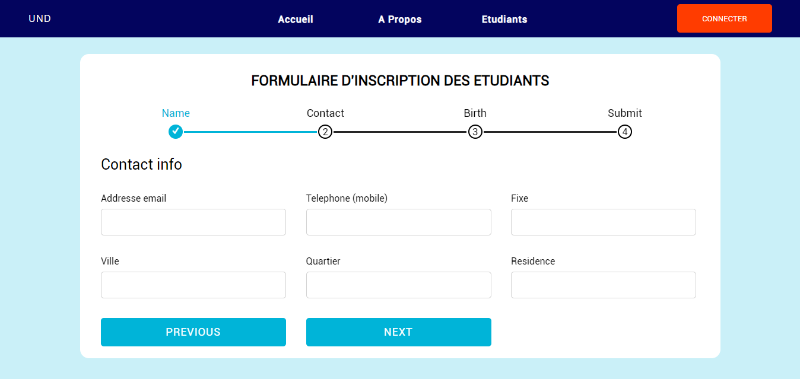
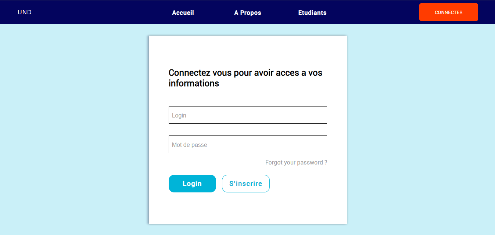
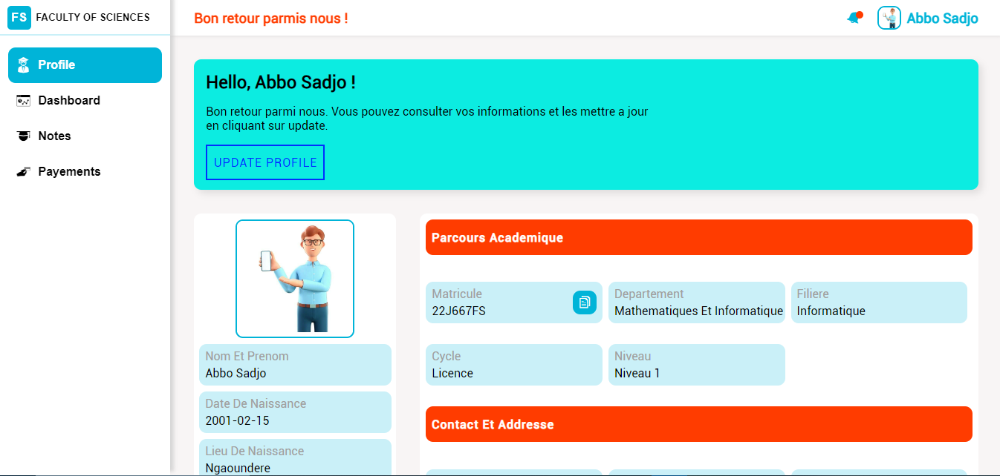
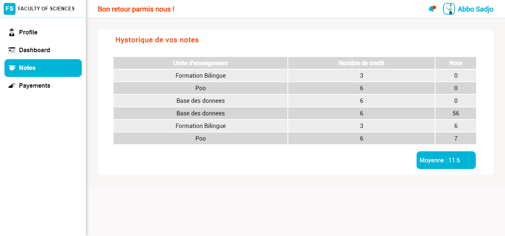
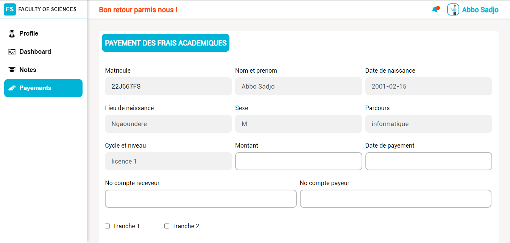
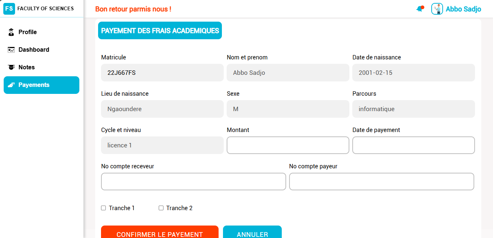
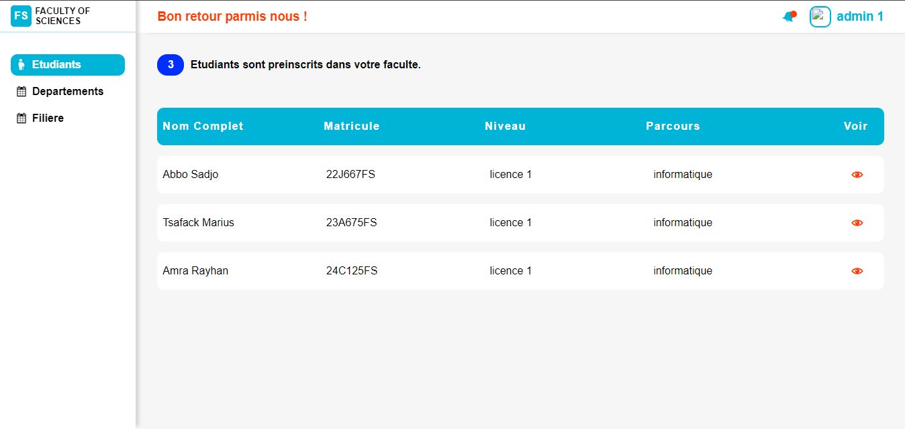
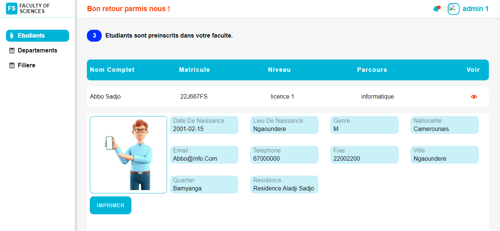

# Profil des étudiants de la Faculté des Sciences

## Description
Ce projet est réalisé en groupe dans le cadre des Travaux Pratiques de l'Unité d'Enseignement (UE) Introduction à la base des données. Il vise à créer et gérer une base de données contenant les profils des étudiants de la Faculté des Sciences.

## Note
Ce projet a été réalisé dans un temps très limité et en parallèle d'autres projets pour d'autres UE. Cette version constitue donc une organisation et des fonctionnalités basiques, dont certaines n'ont pas pu être achevées.

## Objectifs
- Apprendre les concepts de base des bases de données.
- Mettre en pratique les techniques de modélisation et de gestion des données.
- Développer des compétences en travail d'équipe et en gestion de projet.

## Réalisations
1. **Conception de la base de données** : Modélisation des données et création du schéma de la base de données.
2. **Implémentation** : Création des tables et insertion des données.
3. **Développement ** : Création de l'interface utilisateur pour faciliter la manipulation des données.
4. **Requêtes** : Écriture de requêtes SQL pour manipuler et interroger la base de données.
5. **Documentation** : Rédaction de la documentation du projet et des instructions d'utilisation.

## Technologies utilisées
- SGBD : MySQL
- Langage de requête : SQL
- **Langage de Programmation** : PHP
- **Frontend** : HTML, CSS, JavaScript
- Outils de modélisation : StarUML
- **Serveur Web** : Apache

## Mon rôle l'équipe
- Conception / Modélisation (en équipe)
- Design
- Développement
- Présentation (en équipe)

## Captures d'écran
Quelques images de l'interface sont disponible dans images/captures/ :

## Remerciements
Merci à notre enseignant pour son soutien et ses conseils tout au long de ce projet.

